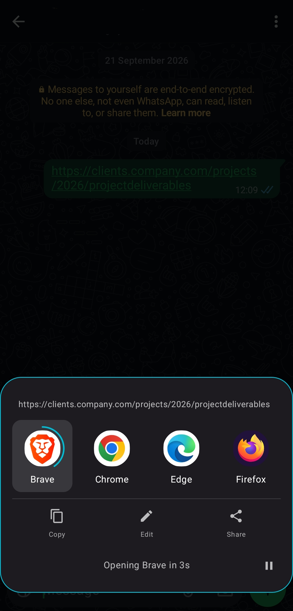
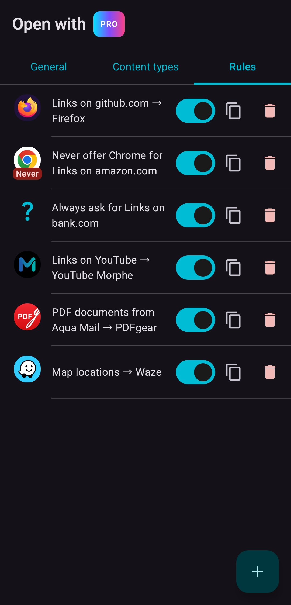
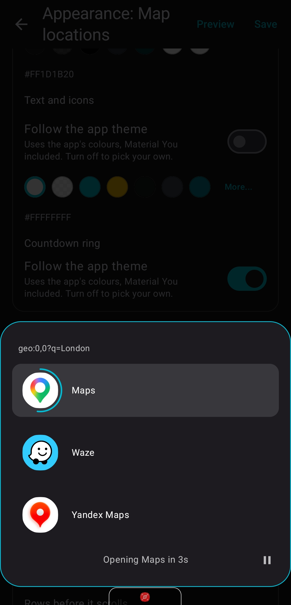
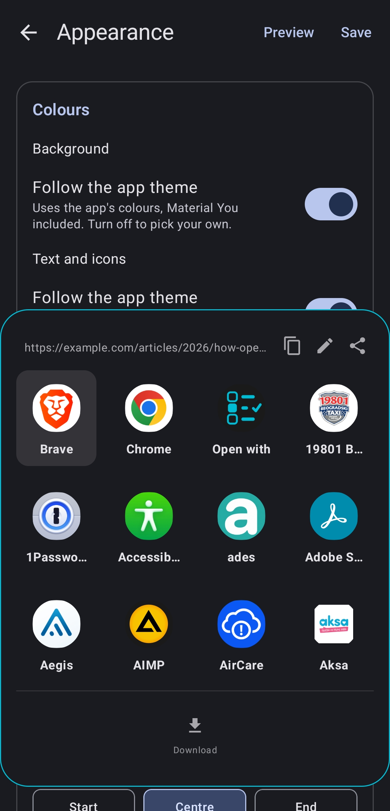
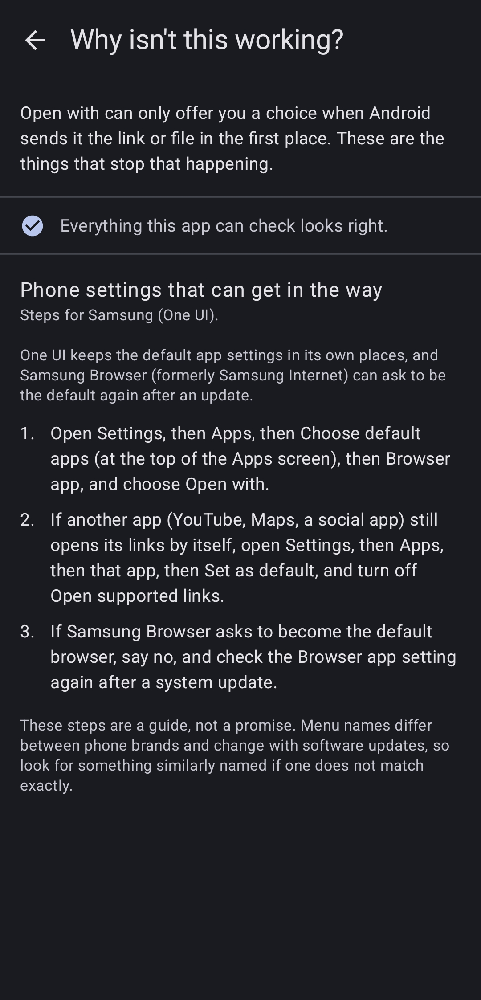

# Open with

### Choose which app opens every link, file and share

**Take back control of every link, file and share. Make Android yours again.**

  

*Dedicated to my son Mihajlo.*

---

Android decides which app opens your links, files and shares, and since Android 12 it rarely even asks. Open with puts you back in charge. Pick any app on your phone each time from a small chooser, or set up rules once and let everything open where it should, automatically.

---

## 💼 Made for people who run their work from their phone

Calls, site visits, clients on three messengers. Set it once and stop choosing.

- **Work links in your work browser** - links from Slack or Teams open in the browser you're signed into for work, everything else in your personal one.
- **Addresses straight into navigation** - map pins and addresses from messages and email open in the navigation app you drive with.
- **Contracts and invoices straight into your signing or PDF app** - no viewer in between, no "open with" list.
- **A pause only where it counts** - "Always ask" before your bank or payment pages, and nothing in the way everywhere else.

Fewer taps, fewer wrong apps, more time for the work itself.

---

## 💬 Feedback, bug reports & feature requests

This repository is the home for **reporting issues and requesting features** for Open with.

- 🐞 **Found a bug?** [Report a bug](../../issues/new?template=bug_report.yml) and tell us what happened, what you expected, and your device / Android version.
- 💡 **Have an idea?** [Request a feature](../../issues/new?template=feature_request.yml) - I read every suggestion.
- 👍 **Want something that's already been suggested?** Browse [bug reports](../../issues?q=is%3Aissue+label%3Abug) and [feature requests](../../issues?q=is%3Aissue+label%3Aenhancement) and add a 👍 or a comment so I know it matters to you.

Please search the [open issues](../../issues) first to avoid duplicates.

Bug reports are much easier to act on with a debug log attached: turn on the Debug Log under General, reproduce the problem, then share the log.

---

## ✨ What you can do

- **Any app, not just the ones Android suggests** - Amazon links in the Amazon app, Reddit links in your favourite client, text files in the notepad you actually use.
- **Rules that open things for you** - YouTube links always in YouTube Morphe, PDFs from Gmail in Acrobat, never offer Chrome for Amazon links. Set it once, and it happens with nothing on screen. See below.
- **Every kind of content** - links, video and audio streams, images, audio and video files, PDFs, ebooks, Word, Excel and PowerPoint files, text, archives, APKs, torrents, map locations, navigation, email addresses, phone numbers, text messages, Play Store links, web searches and shared items. Add your own file types too.
- **A page for each content type** - its own default app, "open without asking", hidden apps, sort order, the last app remembered, its own countdown and its own look.
- **A chooser you can make your own** - a countdown paused by any touch, grid or list, sizes, corners, width and position on screen, Material You colours from your wallpaper or your own, and over 40 open and close animations, all with a live preview.
- **Do more than open** - copy, edit or share a link before it opens, or hand it to your download manager.
- **One app for a while** - hold any app in the chooser to use it for the next 10 minutes or the next 5 links, or to make a rule on the spot.
- **Sign-ins keep working** - Open with answers custom tab requests, so app sign-ins that need a real browser tab work with Open with as your default browser. Links that apps would show inside themselves can open in your real browser instead.
- **Help when something doesn't arrive** - "Why isn't this working?" checks your setup, names the app holding a website and shows the steps for your phone. Diagnostics shows exactly which rule would win for any link.
- **Android TV** - D-pad friendly throughout.
- **Backup and restore** - everything in one file you keep.

---

## 🧠 Rules

A rule decides where something opens, so you don't have to choose every time.

**What a rule can do**

- **Open with** one app of your choice, and optionally always in your real browser rather than inside the app that asked.
- **Never offer** the apps you never want to see for that content.
- **Always ask**, bringing the chooser back for the things you want to decide each time, even where a default app would open them silently.

**What a rule can match on**

- **The website** - by exact name, wildcard (`*.example.com`), address prefix, a word it contains, or a regular expression, with a built-in help page and tester.
- **The content type** - links, PDFs, images, map locations and the rest.
- **The file name** - starts with, ends with, contains, or a regular expression.
- **The app it came from** - only from these apps, or from any app except these.

A rule can list several things to react to ("these websites or these files"), each with its own conditions.

**Living with them**

- **The most specific rule wins**, so a rule for one website beats a rule for all links.
- **Rules name themselves** as you build them ("github.com → Firefox", "PDF documents from Gmail → Adobe Acrobat"), or you give them your own name.
- **Hold an app in the chooser** to make a rule for that website or content type without leaving what you were doing.

---

<!--
## 📸 Screenshots

(Uncomment this section, and add "---" after it, once the eight screenshots are in Screenshots/.
The shot list is in Playstore.md, "Screenshots".)
-->

## 🔒 Your privacy comes first

- **Open with never sends your links or files anywhere.** Everything it decides, it decides on your phone.
- **No ads. No trackers. No analytics.**
- **No account, no sign-up, no email required.**
- **The Debug Log is optional**, off by default, and stays on your phone unless you share it.

Open with only needs to see which apps are installed (see below). Setting it as your default browser is optional and only needed for web links.

---

## 🔑 Why Open with can see your installed apps

Open with asks Android for the list of installed apps. That is how it can offer **any** app, not just the ones that officially claim a link or file, and how it finds the right apps for each content type. The list is used on your phone only, to fill the chooser and the settings screens, and it never leaves your phone.

On Android 12 and newer, web links go straight to your default browser unless another app has claimed the website. So for Open with to see web links at all, you set it as your **default browser** (Settings > Apps > Default apps > Browser app). It then offers your real browsers, or opens the one your rules pick. Files, maps, email and everything else work without this.

---

## 🌍 Languages

Open with is available in **50 languages** and follows your phone's language automatically:

Arabic, Bengali, Bulgarian, Catalan, Chinese (Simplified), Croatian, Czech, Danish, Dutch, English, Estonian, Finnish, French, German, Greek, Gujarati, Hebrew, Hindi, Hungarian, Icelandic, Indonesian, Italian, Japanese, Kannada, Korean, Latvian, Lithuanian, Malayalam, Marathi, Norwegian, Persian, Polish, Portuguese (Brazil and Portugal), Punjabi, Romanian, Russian, Serbian (Cyrillic and Latin), Slovak, Slovenian, Spanish, Swahili, Swedish, Tamil, Telugu, Thai, Turkish, Ukrainian, Urdu, Vietnamese and Zulu.

If something reads wrong in your language, please [report it](../../issues/new?template=bug_report.yml).

---

## 📌 A few things to know

- Available in **50 languages** (see above).
- Works on **Android 10 and newer**, on phones, tablets and Android TV.
- **Free, with an optional one-time upgrade.** Web links, website rules (including "never offer", "always ask", "always open in the browser" and the app a link came from), the chooser and its colours, backup, Diagnostics, custom tab support and Android TV are free. Open with Pro, a single purchase with no subscription, adds every other content type, the countdown, per-type settings, any app as a target, temporary choices, file name rules, your own file types, and the chooser's extra actions and looks.
- An app that already holds a website, or a phone maker's own settings, can get in first. "Why isn't this working?" tells you which, and how to fix it.
- **Using a work profile?** Apps inside it can't be reached from your personal profile, and links tapped there never arrive. Install Open with in the work profile too: each side has its own rules.
- Never shows up in your recent apps.

---

Open with is for anyone who wants to decide for themselves what opens where. Give it a try and make Android yours again.

